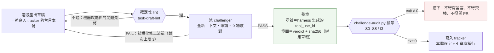
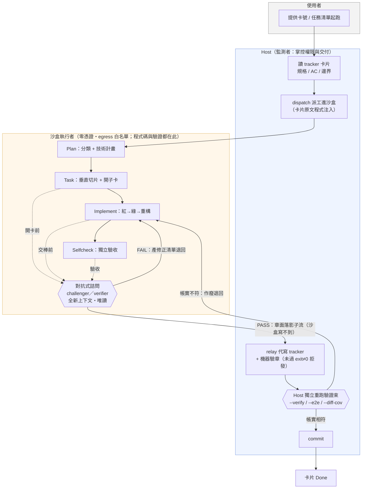
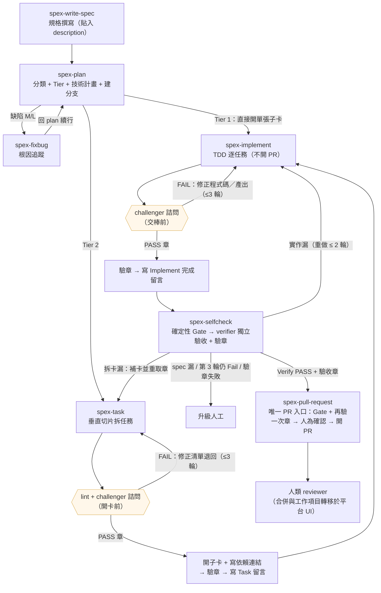
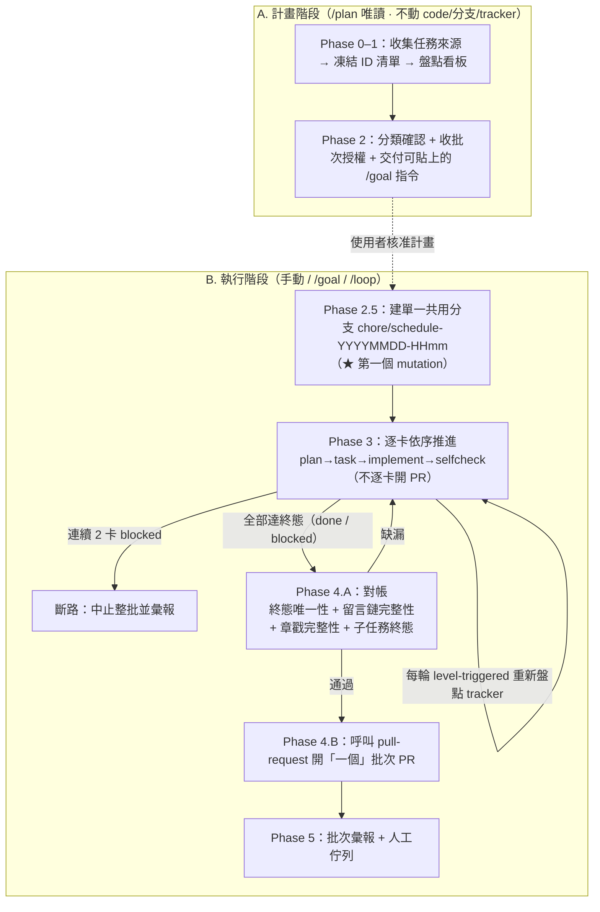
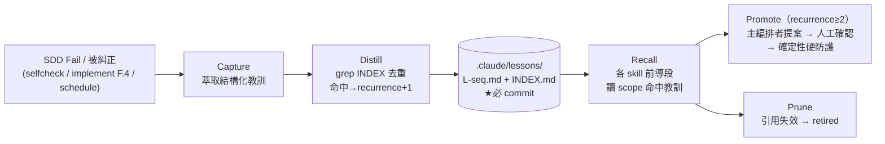

```text
   _____
  / ___/____  ___  _  __
  \__ \/ __ \/ _ \| |/_/
 ___/ / /_/ /  __/>  <
/____/ .___/\___/_/|_|
    /_/
```

> **spex** — 把 SDD（spec-driven development）的 skills、reference 與 MCP 設定一鍵安裝到任何專案，**一份來源、多 agent 落地**，同時支援 **Claude Code**、**GitHub Copilot** 與 **OpenAI Codex CLI**。

   

---

## 目錄

- [這是什麼 · 核心理念](#這是什麼--核心理念)
- [運作原理總覽](#運作原理總覽)
- [需求](#需求)
- [安裝](#安裝)
- [使用](#使用)
- [SDD 流程總覽（流程圖）](#sdd-流程總覽流程圖)
- [批次排程生命週期（流程圖）](#批次排程生命週期流程圖)
- [每個 SKILL 的內部流程](#每個-skill-的內部流程)
- [實踐原理（為何這樣設計）](#實踐原理為何這樣設計)
- [治理機制總覽](#治理機制總覽)
- [支援的 Agent](#支援的-agent)
- [支援的 Tracker](#支援的-tracker)
- [與其他開源 SDD 框架的比較](#與其他開源-sdd-框架的比較)
- [Rules（專案規則）](#rules專案規則)
- [估點與成本](#估點與成本)
- [貢獻指南](#貢獻指南)
- [參考資料](#參考資料)
- [常見問題 · 升級注意](#常見問題--升級注意)
- [授權 / 使用範圍](#授權--使用範圍)

---

## 這是什麼 · 核心理念

`spex` 是一支 CLI，把一套 SDD 工作流（12 個 skills + reference + 專案規則 rules + MCP 設定）裝進任何專案。核心設計：

- **一份來源、多 agent 落地**：skills/reference/rules 只維護一份，安裝時動態轉換成各 agent 的原生格式（Claude Code 的 `.claude/`、Copilot 的 `.github/` + `.spex/`、Codex 的 `.codex/`）。
- **tracker 為唯一事實來源、adapter 化可替換**：流程的「狀態、證據、續行」都落在 tracker 的 work item / issue 留言鏈，不依賴本機檔案——壓縮 / 換手 / 斷線後由下一輪重新盤點自動還原。tracker 本身透過 `TRACKER.*` 抽象介面存取，目前內建 **Azure DevOps** 與 **local-file**（無 tracker 時的純檔案模式）兩個 adapter，用 `create-adapter` skill 即可新增 Jira / Linear / GitHub Issues 等其他專案管理平台的 adapter，SDD 流程本身不綁死任何單一平台（詳見[支援的 Tracker](#支援的-tracker)）。
- **可靠度建在不依賴模型自律的硬防護上**：獨立驗收的確定性 Gate、PR 開立的權限層防護、繞過管道的 MCP-only 封鎖、失敗教訓的閉環升級。

---

## 運作原理總覽

> 這一節分兩層：**核心原則**適用於任何一次 `spex init` 安裝；**進階沙盒執行模型**則是另外跑過 `spex-sandbox-init` 並開啟對應開關才會疊加的加強版。裝完直接用 `/spex-plan`、`/spex-implement` 等核心 skill 的預設流程圖見下方 [SDD 流程總覽](#sdd-流程總覽流程圖)；細部的 skill 拆解見[每個 SKILL 的內部流程](#每個-skill-的內部流程)。

### 核心原則（所有安裝都適用）

不論有沒有另外接上 Docker 沙盒，SDD 流程的可靠度都建立在同一組原則上：規格先行、把「完成」定義成可驗證的 AC；獨立驗收先行於信任——`spex-selfcheck` 先跑**確定性 Gate**（驗證指令束 + 完整 E2E，任一失敗直接判定 Fail），再由**全新上下文**（新對話 / subagent / `codex exec`）的驗證者只憑「AC + diff + 機器證據」做二元判定，找不到證據一律視為 Fail；重做有上限（2 次），超限一律升級人工、絕不無限自轉。這套「機器閘門先行、人為判斷做底線」的設計，細節見下方[實踐原理](#實踐原理為何這樣設計)。

再往前一步：**交棒憑證本身也不能靠自述**。`spex-task`（開卡前）與 `spex-implement`（交棒前）的產出，都要先過一道對抗式詰問並取得一枚**程式可驗的章**才准寫進 tracker：



**讀圖重點**：

- **章不是一句 PASS**：章號由 harness 生成（模型鑄造不出來）、章面落在子代理事件內（主 agent 的文字偽造不進去）、章面的 sha256 綁定受審草稿（**蓋章後改一個字就失效**）。自己補寫章面或自算 sha256 一律視為偽造。
- **判定與蓋章分離**：challenger 只詰問不改檔，修正是原階段的事；驗章只由程式裁定，**結果不可被 LLM 改判**。
- **強度依環境而異**：沙盒 > Claude Code > Codex／Copilot（後者沒有可驗的章）——見下一節末的「章的強度分三層」表。

### 進階：Docker 沙盒執行模型（選用，`spex-sandbox-init`）

`spex-sandbox-init` 這個選用 skill 可以再疊加一層機器強制的**雙平面架構**：程式碼探索、寫 code、跑驗證都搬進**零憑證、egress 白名單的 Docker 容器**執行——容器連不出去、也拿不到任何 git / tracker 憑證；容器每次交棒前，由一個**全新上下文、唯讀**的 challenger／verifier 做敵對式詰問，只有 PASS 才蓋章交棒，FAIL 就帶著結構化修正清單退回；Host 端收到蓋章結果後，**自己再獨立重跑一次驗證束**，確認「帳實相符」才 commit。這是設計時的目標架構，目前落地在 `spex-sandbox-init` 生成的沙盒協定裡，且協定預設**關閉**這條驗證鏈（`sddSkillGuardEnabled`，需在 Sandbox Profile 明確開啟）——**8 個核心 skill（plan / task / implement / selfcheck / pull-request / fixbug / write-spec / schedule）本身並不依賴 Docker 或沙盒才能運作**，未接沙盒時獨立驗收一樣會發生，只是在同一份原始碼樹內完成、不涉及獨立容器與 Host relay。



**讀圖重點**（本圖描述的是**啟用沙盒後**的加強模型，見上方說明）：

- **雙平面**：程式碼探索、寫 code、跑驗證、對抗式詰問全程在**沙盒**內完成，且沙盒零憑證、egress 白名單——寫不出沙盒、連不出去；tracker 讀寫、git commit、開 PR 只在 **Host** 進行。
- **章戳鏈**：交棒（Task → Implement、Implement → Selfcheck、Selfcheck 驗收）前，都先派一個**全新上下文、唯讀**的 challenger／verifier 做敵對式詰問；只有全 PASS 才蓋章交棒，FAIL 就帶著結構化修正清單退回，不論留言怎麼寫都不算數。**章不是一句 PASS**：章號是 harness 生成的 `tool_use_id`（模型鑄造不出來）、章面落在子代理事件內（主 agent 的文字偽造不進去）、章面帶 sha256 綁定受審內容（蓋章後改一個字就失效），下游由 `challenge-audit.py` 程式重驗，exit ≠ 0 一律不得交棒。
- **機器閘門而非自律**：Host 收到蓋章結果後**自己獨立重跑一次驗證束**（lint / typecheck / test / E2E / diff coverage），數字與執行者自報「帳實相符」才會 commit——這一步是決定性的反做假機制，不是「看 AI 說完成就算完成」。

**章的強度分三層，不同環境不等價**（誠實標註，細節見 `assets/rules/sdd-workflow.md`「章戳鏈」）：

| 強度 | 環境 | 章的載體與保護 |
|---|---|---|
| 最強 | 啟用沙盒 | 影子流由 Host tee 到掛載區之外，容器**物理寫不到** |
| 中 | Claude Code（未接沙盒） | 事件流由 harness 寫在 `~/.claude/projects/`；spex 安裝的 PreToolUse 硬閘擋下「未驗章的 tracker 寫入」與「對事件流的改寫」 |
| 無 | Codex / Copilot | 無 subagent 註冊機制、無事件流 → **沒有可驗的章**，只剩確定性 lint |

各 skill 的 Phase 拆解見下方[每個 SKILL 的內部流程](#每個-skill-的內部流程)，跨 skill 的治理規則見 [`assets/rules/sdd-workflow.md`](assets/rules/sdd-workflow.md)，沙盒協定本身見 `assets/reference/sandboxes/README.md`。

---

## 需求

- **Node.js ≥ 18**（開發建議與 [`.nvmrc`](.nvmrc) 對齊的版本）與 npm
- Git（用於 clone 本 repo）
- 已安裝下列至少一種 AI 代理 CLI / 擴充：**Claude Code**、**GitHub Copilot（VS Code）**、**OpenAI Codex CLI**
- 若要使用 MCP 整合（Azure DevOps / GitHub 等）：對應服務的 Personal Access Token（安裝時只會引導你把它放進 shell 環境變數，CLI 本身不會幫你代填）

---

## 安裝

### 1. CLI 本身

```bash
# 1. clone 到固定路徑（之後更新會用到）
git clone https://github.com/bibirock/spex.git spex-cli
cd spex-cli

# 2. 安裝依賴（prepare 鉤子會順帶跑 tsc 產生 dist/）
npm install

# 3. 全域安裝
npm install -g .
```

更新到最新版：

```bash
cd <你 clone 的路徑>/spex-cli
git pull && npm install -g .
```

### 2. 裝進你的專案

```bash
cd <你的專案>
spex init   # 互動式：偵測 agent、挑 skills、寫入 skills/reference/rules，並設定 PR/MCP-only 防護
```

---

## 使用

### `spex init`

互動式初始化 — 偵測目標專案的 agent、挑要安裝的 skills、寫檔。會一併安裝 [reference](#支援的-agent)、[**專案規則 `rules/`**](#rules專案規則)、[**PR 開立防護**](#3-pr-開立防護流程層--技術層) 與 [**MCP-only 繞過防護**](#4-mcp-only-繞過防護中層)。

```bash
spex init
```

### `spex uninstall`

```bash
spex uninstall                   # 移除全部：skills / reference / rules / agent 文件 / MCP / 防護規則
spex uninstall spex-plan   # 只移除指定 skill（保留 reference / rules / MCP）
spex uninstall --agent codex -y  # 指定 agent 並跳過確認
```

> 防護規則（`permissions.ask` / `permissions.deny` / denyList / sandbox）採「所有權清單」移除：只刪 spex 寫入、與常數完全相符者，使用者自訂設定一律保留。

### `spex mcp [setup]`

設定 MCP server 與環境變數慣例。**機密 token 一律走 shell 環境變數，絕不在專案內建立任何 dotenv 檔。**

```bash
spex mcp setup --agent claude-code
echo 'export AZURE_DEVOPS_PAT=<your-token>' >> ~/.zshrc
echo 'export GITHUB_PAT=<your-token>'        >> ~/.zshrc
source ~/.zshrc
```

| Agent          | MCP 設定檔                                   | token 佔位                                                                   |
| -------------- | --------------------------------------------- | ------------------------------------------------------------------------------ |
| Claude Code    | `.mcp.json`（`mcpServers`）                   | `${VAR}`                                                                        |
| GitHub Copilot | `.vscode/mcp.json`                            | `${env:VAR}`                                                                    |
| OpenAI Codex   | `.codex/config.toml`（`[mcp_servers.<id>]`）  | 不內插；stdio 用 `env_vars`、http 用 `bearer_token_env_var` 轉發本機環境變數 |

---

## SDD 流程總覽（流程圖）

一張卡片從規格到 PR 的主鏈：`write-spec → plan →[fixbug M/L]→[task Tier2]→ implement → selfcheck ⇄(重做≤2) → pull-request`。



**讀圖重點**：

- **Tier 1 捷徑**：`plan` 直接開單張 Task 子卡 → 跳過 `task`，直進 `implement`。
- **缺陷分流**：`plan` 判缺陷 M/L → `fixbug` 根因 → 回 `plan` 續行。
- **兩道詰問閘門**：`task` 在**開卡前**、`implement` 在**交棒前**，各要取得 challenger 的 PASS 章；未過不得寫 tracker。輪次上限 3（＝2 次重詰），由驗章器程式硬執行。
- **selfcheck 重做迴圈依缺口層級路由**：`實作漏` 回 `implement`（最多 2 次重做）、`拆卡漏` 回 `task` 補卡並重取章、`spec 漏` 直接**升級人工**（規格問題重做解不了），絕不無限自轉。
- **PR 唯一入口**：只有 `pull-request` 能開 PR，前置必為 selfcheck 的 **Verify PASS**，且開 PR 前會再驗一次章（含 `HEAD` 是否在 PASS 後又動過）。

---

## 批次排程生命週期（流程圖）

`spex-schedule` 把**多卡片批次**（或單卡無人值守）連續推過 SDD 鏈。起跑序固定：**`/plan`（唯讀，必經）→ 執行驅動（手動 / `/goal` / `/loop` 三選一）**。



**讀圖重點**：

- **計畫↔執行分界**：第一個寫入動作（建分支 / 動 tracker / 改 code）一律在離開 `/plan` 之後；Phase 2.5 建共用分支是分界點。
- **單一共用分支、一個批次 PR**：整批都在 `chore/schedule-<date-time>` 上實作，**不逐卡建分支、不逐卡開 PR**；對帳通過後只開**一個**涵蓋全批的 PR。
- **level-triggered**：每輪重新盤點 tracker 留言鏈推導階段，不信任上一輪快取；終態唯一（done / blocked）；連續 2 卡 blocked → 斷路。
- **schedule 自身禁止開 PR**：批次 PR 由 schedule **呼叫** `pull-request` 開立，唯一入口不變。

---

## 每個 SKILL 的內部流程

> 多數 skill 以 `/spex-<name>` 呼叫（Claude Code）；`commit-message`、`create-adapter` 兩個工具型 skill 例外，資料夾與呼叫名稱**不帶** `spex-` 前綴（分別是 `/commit-message`、`/create-adapter`），對照見下方第 10、11 節。無人值守時由 `spex-schedule` 依各卡留言鏈自動推導下一步，不需手動逐個下指令。

### 1. `spex-write-spec` — 規格撰寫

**角色**：需求分析師，透過問答與邊界探索把模糊想法寫成符合 `spec-template` 的結構化規格。

| Phase                 | 做什麼                                                                      |
| ---------------------- | ----------------------------------------------------------------------------- |
| 0 模式判斷            | 全新規格 vs 補強既有 item（讀 tracker、比對缺漏章節）                       |
| 1 讀範本              | 讀 `spec-template.md`，以其必填章節與品質檢核清單作產出契約                 |
| 2–3 問答              | 角色與旅程、In/Out Scope 邊界；五維邊界探索（空值/格式/上限/錯誤路徑/權限） |
| 4 列舉完整性          | 成組項目完整列舉 + grep 確認 + 請使用者確認                                 |
| 4.5 規模拆分          | 六項客觀訊號 → Epic vs 單一 Story；子 Story 必 INVEST（≤13）                |
| 5 產出規格 → 5.5 估點 | 依範本逐章輸出；**強制估點**（四維 Fibonacci 1–13）                         |
| 6 交付                | 指引貼入 description                                                        |

**前置**：無 → **後續**：`spex-plan`

### 2. `spex-plan` — 分類 + 技術計畫

**角色**：資深工程師，做分類（需求/缺陷、Tier、缺陷規模）與輸入檢核、建工作分支、產技術計畫。

| Phase           | 做什麼                                                                                               |
| --------------- | ------------------------------------------------------------------------------------------------------ |
| 1–1.2 取上下文  | 讀規格 / 解析分支 ID、附件；前置分支檢核                                                             |
| 2.1–2.4 分類    | A 路線（需求/缺陷）→ B Tier（任一重訊號成立 → Tier 2）→ C 缺陷規模 S/M/L → D 輸入規格檢核            |
| 2.4E–2.5        | 現有程式碼結構分析；疑點提問（不限數量、不湊題數）                                                   |
| 2.6 建分支      | `ensureBranch`（批次模式 no-op）                                                                     |
| 2.7 缺陷分流    | 缺陷 M/L 找不到 fixbug 留言 → **停止，要求先跑 fixbug**                                              |
| 2.8 Tier 1 捷徑 | 直接開單張 Task 子卡，跳過 Phase 3–8                                                                 |
| 3–8             | 政策確認 → MVP 邊界 → 量化驗收（每條 AC 須說「為何選/不選單元測試」）→ 技術計畫摘要 → 寫 `Plan` 留言 |

**前置**：write-spec → **後續**：task（Tier 2）/ implement（Tier 1）/ fixbug（缺陷 M/L）

### 3. `spex-fixbug` — 缺陷根因

**角色**：資深工程師，深入分析根因、查第三方套件議題，提供修復方向給 plan（**不寫程式碼**）。

| Phase              | 做什麼                                                                     |
| -------------------- | ----------------------------------------------------------------------------- |
| 1–1.3 前置         | 驗證缺陷路線 / M-L 規模 / 重現步驟 / 修復定義；載入 SDD 規則               |
| 2 症狀分析         | 五維拆解；重現穩定性（必現/高頻/偶發）；**強制蒐集輸入樣本**並本地驗證重現 |
| 3 影響面           | 內部影響（file:line）+ 外部依賴清單                                        |
| 4 外部調查         | GitHub issue/PR/code 搜尋 + Stack Overflow；證據編號彙整                   |
| 5 根因假設         | 1–3 條假設（支持/反駁證據、驗證方法、優先級）→ 選主假設或標 spike          |
| 6 修復方向         | 只寫方向/層級/預期/風險；偶發 Bug 必含穩定重現策略                         |
| 8 寫 `fixbug` 留言 | 展示 → 確認 → `addComment`                                                 |

**前置**：plan（缺陷 M/L 分流）→ **後續**：回 `spex-plan`

### 4. `spex-task` — 垂直切片拆任務

**角色**：技術領導，把技術計畫拆成可獨立驗證的 TDD 任務、定義 AC、寫依賴連結。

| Phase          | 做什麼                                                                                               |
| -------------- | -------------------------------------------------------------------------------------------------------- |
| 0–1 前置       | 解析 Plan 留言；找不到 → 停止要求先跑 plan                                                           |
| 3 垂直切片     | 每任務 = 完整使用者路徑（API→Store→Logic→UI），**禁止水平分層**；分 Foundation / Vertical Slice      |
| 4 任務清單     | 任務摘要表 + 逐任務 TDD（Red/Green/Refactor）+ AC + 驗證指令                                         |
| 4.5 硬閘門     | `task-draft-lint` 確定性檢查 → 派 `challenger` 對抗式詰問（圍欄＝將寫入的留言本體）→ **取得 PASS 章才可開卡** |
| 5 寫入 tracker | 建子卡（`createChildTask`）→ **展示全部依賴邊 → 確認 → 逐邊 `linkDependency`**（任務相依的事實來源）→ 留言追加引章行、`spex-stamp` 驗章 exit 0 才寫入；真實子卡 ID 另寫獨立留言（不進蓋章本體） |

**前置**：plan（Tier 2）→ **後續**：`spex-implement`

### 5. `spex-implement` — TDD 逐任務實作

**角色**：開發工程師，主 agent 依序執行（不派 subagent）TDD（Red→Green→Refactor），同步 tracker，**不開 PR**。

| Phase         | 做什麼                                                                                                                                  |
| ------------- | -------------------------------------------------------------------------------------------------------------------------------------------- |
| 0–2           | 上下文 / 分支檢核；`getDependencies` 建 DAG 拓撲排序（循環依賴 → 回 plan）                                                              |
| 3A–3D TDD     | Red（寫失敗測試並跑一次確認失敗）→ Green → Refactor（驗證指令束全綠；**commit 前清 artifact**）                                         |
| 3F Escalation | **F.4 E2E 失敗**：重試 → 外部知識查詢 → 仍不過 → **判 Fail、寫 `Verify Fail`、捕捉教訓（trigger `implement-f4`）、阻斷整鏈**，絕不 skip |
| 3G 標記完成   | 驗證全綠 → code-reviewer → `/commit-message` 提交 → 任務 `done`                                                                          |
| I 父卡閉環    | 補父卡測試 + 完整 E2E + 官方 `/review` → **對抗式詰問取 PASS 章** → 驗章 exit 0 才寫「Implement 完成」留言                              |

**教訓閉環**：前導段 Recall；F.4 Capture（Promote 不在此，集中於 selfcheck）。
**前置**：task / plan(Tier 1) → **後續**：`spex-selfcheck`

### 6. `spex-selfcheck` — 獨立驗收

**角色**：獨立驗收編排者，PASS/FAIL 二元判定且必附證據。

| Phase         | 做什麼                                                                                                                     |
| ------------- | ------------------------------------------------------------------------------------------------------------------------------ |
| 0 輪次判定    | 第 N 輪；**N+1 > 3 → 不驗收，直接升級人工**                                                                                |
| 1 輸入打包    | AC 清單 + `git diff` + 機器證據；**鐵則：不含實作推理 / 對話歷史**                                                         |
| 2 確定性 Gate | 驗證指令束 + 完整 E2E；任一 exit≠0 → 直接 Fail（零 LLM 成本）                                                              |
| 3 獨立判讀    | 全新上下文 `verifier` 逐條 AC 二元判定 + 防錯檢核 **A AC 覆蓋 / B 列舉完整性 / C 範圍外變更 / D 測試弱化 / E 三向 traceability（標缺口層級）/ F 章戳 / G 任務卡未被丟棄**；無證據 = Fail |
| 4 判定路由    | 主編排者跑 `spex-stamp` 驗章（exit ≠ 0 → Fail，不可被 LLM 改判）→ PASS 寫「Verify 完成」＋驗收章；**Fail → 依缺口層級路由（實作漏回 implement／拆卡漏回 task／spec 漏升級人工）＋ 捕捉教訓 + recurrence≥2 提案 Promote（人工確認）**；重做 ≤ 2 輪，超限升級人工 |

**鐵則**：驗證者只讀證據、**永不改 code**、不背 Capture/Promote 職責。
**前置**：implement → **後續**：pull-request（PASS）/ implement（Fail）

### 7. `spex-pull-request` — PR 開立唯一入口

**角色**：PR 守門員，唯一允許呼叫 `TRACKER.createPullRequest` 的 skill。

| Phase        | 做什麼                                                                                          |
| -------------- | ----------------------------------------------------------------------------------------------------- |
| 1.1–1.2 Gate | 分支檢核；**Verify Gate（不可繞道）**：逐卡確認最新 Verify = PASS（批次模式逐卡檢查），否則停止 |
| 1.3–1.5      | 子任務全 done；分支已推送（禁 force push）；查 active PR（非本流程開立 → 告警停止）             |
| 2 組裝       | `createPullRequest`（含 selfcheck AC 對照表、E2E 報告連結；`autoComplete=false`）               |
| 3 人為介入   | 防護狀態檢查（`permissions.ask` 三條，缺 → 標 `degraded`）；**互動確認 / 預授權雙路徑**         |
| 4 收尾       | 開 PR（批次只開一次）→ 對每張父卡寫稽核留言 → 刪除暫留 E2E 報告                                 |

**教訓閉環**：前導段 Recall（PR 層失敗可被取回）。
**前置**：selfcheck PASS → **後續**：人類 reviewer

### 8. `spex-schedule` — 多卡批次排程 / 任務相依編排

**角色**：批次排程者，逐一、依序把一批卡片推過 SDD 鏈，保證終態唯一、不遺漏。（內部流程見 [批次排程生命週期](#批次排程生命週期流程圖)。）

- **驅動三選一**：**手動**（小批次，一個 context 跑得完）/ **`/goal`**（大批次或無人值守，跨壓縮存活 + 收斂驗證 + turn 上限）/ **`/loop`**（卡片常等外部事件）。
- **典型呼叫**：`/spex-schedule 幫我執行 <卡號1> <卡號2> … 使用 plan 來規劃` → 得到計畫 + 可貼上的 `/goal` 指令。

**前置**：各卡規格已寫入 description → **後續**：人類 reviewer 審單一批次 PR

### 9. `spex-benchmark` — 成本與目標量測（工具型）

**角色**：量測已完成 SDD 工作的 token 成本與 4 大目標進度（**手動觸發，不被自動鏈呼叫；不實作、不開 PR**）。

| Phase | 做什麼                                                                                                    |
| ------- | -------------------------------------------------------------------------------------------------------------- |
| 0     | 確認各卡估點 + USD→TWD 匯率（讀不到 → 請使用者提供或填 N/A）                                              |
| 1     | 以「觸發本 skill 的訊息 timestamp」為截點，加總截點前 token / 成本（排除本 skill 自身；ccusage 交叉驗證） |
| 2     | 產出基準表 + 4 大目標 to-do；$/點 對團隊自訂目標判定                                                      |
| 3     | 經確認後 `recordBenchmark` 寫入 Notion **頁面內文**（表格 / to-do 可渲染）                                |

### 10. `create-adapter` — 新增 Tracker Adapter（工具型）

**呼叫**：`/create-adapter`（folder 與 skill 名稱均為 `create-adapter`，不帶 `spex-` 前綴）。

**角色**：架構設計師，建立 Tracker Adapter 文件讓 spex 支援新追蹤系統（GitHub / Jira / Linear），並同步腳手架相依的 host 端執行層。

流程：讀 `adapters/README.md` 協定 → 12 小節需求問答（12 個必填 `TRACKER.*` 操作可行性、分支前綴、規格建卡欄位對照、relay 執行檔樁檔可行性）→ 對照既有範本起草 → relay 執行檔樁檔生成（或誠實降級）→ 安全可加性設定編輯（`.mcp.json` / `permissions.ask` / 分支命名參數化）→ 安全敏感檢查清單（不自動套用）→ 同步 README 清單 → 展示確認 → 寫入。完成後於 `sdd-workflow.md` 改 `Tracker Adapter:` 一行即可切換分支前綴與欄位映射；tracker 寫入的沙盒 dispatch 管線是否可用，仍取決於是否已補齊 relay 執行檔（見 v0.7.0 升級注意）。

### 11. `commit-message` — Commit 訊息（工具型）

**呼叫**：`/commit-message`（folder 與 skill 名稱均為 `commit-message`，不帶 `spex-` 前綴）。

**角色**：依 Conventional Commits 產生繁中 commit 訊息。串行 8 步：取子卡 ID（tracker 讀回、禁推斷）→ 判 scope/type → 蒐集異動 → 寫描述/本文/footer → 輸出 `type(ID): [scope] 繁中描述`。

### 12. `spex-sandbox-init` — 建立語言無關的 Docker 沙盒（工具型）

**角色**：架構設計師，依 Sandbox Profile 協定為任意語言/技術棧的專案生成雙平面 Docker 沙盒（Docker 隔離、egress 防火牆白名單、PreToolUse guard、確定性驗證束），與 `create-adapter` 是姊妹 skill——本 skill 負責語言/技術棧軸，`create-adapter` 負責 tracker 軸。

流程：讀 `sandboxes/README.md` 協定 → 9 小節需求問答（基底映像、套件管理器、sidecar、驗證束、防火牆、軸 2/3 可行性、格式化/lint、檔案落點）→ 若已有其他 profile 則對照起草，否則直接依協定的核心 Schema 起草 → 執行 `render-profile.mjs --dry-run` 試跑 → 同步 README 清單 → 展示確認 → 實際生成沙盒檔案。**產出的是可運作的沙盒，不只是文件**——`render-profile.mjs` 是本 skill 委派實際檔案渲染的獨立零依賴 Node 腳本，避免 LLM 手動轉譯樣板內容時掉字走樣。

---

## 實踐原理（為何這樣設計）

> 這一節解釋「為什麼要這樣設計」；「實際上怎麼跑」的整體流程圖見上方[運作原理總覽](#運作原理總覽)。

### 1. 規格驅動（spec-driven）

`spec-template.md` 是**單一格式來源**：write-spec 依它產出、plan 依它檢核輸入、selfcheck 以「驗收標準」與「列舉完整性清單」作驗收判定依據。沒有規格約束時 AI 生成會飄移；把 AC 與邊界寫死成可驗證契約，才能讓「完成」有客觀標準。

### 2. 獨立驗收（為何不讓實作者自評）

依業界研究：**LLM 無外部訊號的自我修正不可靠，做事的 agent 不能自己打分**。所以 selfcheck：

1. **確定性 Gate 先行**：驗證指令束 + 完整 E2E，任一 exit code≠0 直接 Fail（零 LLM 成本）。
2. **全新上下文獨立判讀**：驗證者只拿「AC + diff + 機器證據」，採對抗式指示（嘗試推翻 PASS），逐條 AC 二元判定，**無證據 = Fail**。
3. **防錯檢核 A–D**：AC 覆蓋、列舉完整性 grep 勾稽、範圍外變更、測試弱化。
4. 重做有上限（2 次），超限升級人工。

### 3. PR 開立防護（流程層 + 技術層）

**目標：AI 觸發而自動產生的 PR 數 = 0**，同時保留全自動空間。

- **流程層（三 agent 皆有）**：PR 從 implement 拆出，只有 `pull-request` 能呼叫 `createPullRequest`，前置必為 Verify PASS；開立前雙路徑取得人為確認（互動「確認」或含「**授權本次/本批次全自動開立 PR**」明確原文的預授權）；`autoComplete` 一律 false。
- **技術層（Claude Code）**：`init` 把開 PR 管道（`mcp__azure-devops__create_pull_request`、`az repos pr create`、`gh pr create`）寫入 `.claude/settings.json` 的 `permissions.ask`——互動 session 須當下核准、**headless（`claude -p`）自動拒絕**。

### 4. MCP-only 繞過防護（中層）

**prompt 不是 access control**——靠文字叫 AI「請走 MCP」沒有強制力。`init` 把繞過管道封在權限 / sandbox 層，讓「繞過受控 MCP/TRACKER 直打 API/CLI」這條路跑不起來。單一來源 `SPEX_BYPASS_COMMANDS`（`curl` / `wget` / `az boards` / `gh api`），各 agent 落地：

| Agent          | 機制                                                                 | 強度                  |
| ---------------- | ------------------------------------------------------------------------ | ----------------------- |
| Claude Code    | `permissions.deny`（harness 強制，優先序高於 ask/allow）             | 最強中層              |
| GitHub Copilot | `.vscode/settings.json` 的 `terminal.denyList`                       | 僅 VS Code agent 終端 |
| OpenAI Codex   | `config.toml` 的 `sandbox_mode` + `approval_policy`（封網路 egress） | 粒度較粗              |

> **誠實標註**：三 agent 不等價；對 compound command / wrapper / env-var 變體脆弱。Claude Code 的 `PreToolUse` exit-2 硬擋**已在章戳鏈落地**（`spex-stamp-guard.sh`：擋未驗章的 tracker 寫入與對事件流的改寫），但**尚未涵蓋本節的繞過指令家族**——把繞過封鎖也移進 hook 屬另案，且僅 Claude Code 具該能力。刻意**不**封 PR 開立管道（那條走 `permissions.ask` 人工核准）。

### 5. 教訓閉環（lessons-learned loop）

AI 工作流最大的可靠度缺口不是「會犯錯」，而是**同一類錯誤反覆犯**。教訓閉環把失敗變成跟著 repo 走、可取回、可升級為硬防護的持久記憶（依據 Reflexion 反思式記憶 / lessons-learned ledger）。



- **位置**：`.claude/lessons/`（Copilot `.spex/lessons/`、Codex `.codex/lessons/`），**必須 commit、禁止 gitignore**，目錄 on-demand。格式單一來源 `reference/spex/lessons-template.md`，治理單一來源 `sdd-workflow.md` 的 `## 教訓回收與升級`。
- **鐵則**：獨立驗證者不背 Capture/Promote；`createPullRequest` 不因升級旁路。

### 6. tracker 為唯一事實來源

一般 Plan 模式只在當下對話排步驟；spex 把狀態 / 證據 / 續行落到 tracker，因此具備：

| 能力                           | 解決什麼                                                        |
| -------------------------------- | ------------------------------------------------------------------- |
| 中斷續行（每輪重新盤點留言鏈） | 壓縮 / 換手 / 斷線後不丟進度、不重做已完成卡片                  |
| 終態唯一性對帳                 | 杜絕「看起來跑完，其實漏卡」                                    |
| 留言鏈完整性檢查               | 任何過程被遺漏即降階段重推                                      |
| ID 事實鐵則                    | 所有 tracker ID 由 tracker 讀回，防自動編號占號錯關聯           |
| 多 Repo 執行紀律               | 一律絕對路徑（`git -C` / `npm --prefix`），防 `cd` 殘留跑錯目錄 |
| LSP 優先導航                   | 找定義 / 引用優先 LSP，不可用才 fallback grep 並標精度下降      |

---

## 治理機制總覽

| 治理面向         | 對應機制                                                                                                            |
| ------------------ | ------------------------------------------------------------------------------------------------------------------------ |
| PR 開立控管      | 流程層唯一入口 + 技術層 `permissions.ask` + **MCP-only 繞過防護**（封後門直打 API/CLI）                             |
| SDD 流程可靠度   | 獨立驗收（確定性 Gate + 對抗式判讀）+ **教訓閉環**（反覆失敗升級為確定性硬防護，不依賴模型自律）+ DoD「測試未弱化」 |
| 任務相依編排     | `task` 寫 tracker 原生 Predecessor/Successor 連結；`implement` 建 DAG 拓撲排序依序執行；`schedule` 批次編排         |
| Token 成本       | MVP-only 紀律 + 增量看板；`benchmark` 量測每 Scrum point 成本                                                       |

---

## 支援的 Agent

| Agent          | Skill 位置                         | Reference                | Rules                | 教訓                   | MCP 設定             | PR/繞過防護                            |
| ---------------- | ------------------------------------- | --------------------------- | ----------------------- | ------------------------ | ----------------------- | ----------------------------------------- |
| Claude Code    | `.claude/skills/<name>/SKILL.md`   | `.claude/reference/`     | `.claude/rules/`     | `.claude/lessons/`     | `.mcp.json`          | `permissions.ask` + `permissions.deny` |
| GitHub Copilot | `.github/prompts/<name>.prompt.md` | `.spex/reference/` | `.spex/rules/` | `.spex/lessons/` | `.vscode/mcp.json`   | `terminal.denyList`                    |
| OpenAI Codex   | `.codex/skills/<name>/SKILL.md`    | `.codex/reference/`      | `.codex/rules/`      | `.codex/lessons/`      | `.codex/config.toml` | `sandbox_mode` + `approval_policy`     |

> 暫存目錄一律 `spex-temp/`（on-demand scratch，用時才建、用後即刪）。環境變數一律來自 shell（`~/.zshrc` 等），不落檔。

---

## 支援的 Tracker

所有 skill 存取任務追蹤系統一律經由 `TRACKER.*` 抽象介面（`readItem`／`addComment`／`findSpecComment`／`linkDependency`／`createPullRequest` 等），不直接呼叫特定平台的 API/CLI——**tracker 是可替換的 adapter，不是寫死的依賴**。

| Adapter                | 狀態    | 說明                                                                             |
| ----------------------- | ------- | -------------------------------------------------------------------------------- |
| `azure-devops`（`ado`） | 目前預設、功能最完整 | 透過 [Azure DevOps MCP](#安裝) 讀寫 work item；本 repo 隨附的範例值皆為佔位符，需自行設定組織/專案 |
| `local-file`            | 內建    | 無 tracker 時的純檔案模式，狀態落在 repo 內的 `specs/` 目錄                        |
| 其他（Jira / Linear / GitHub Issues / …） | 待新增 | 執行 `/create-adapter` 依協定問答產生新 adapter 文件與 host 端接線；完成後改 `sdd-workflow.md` 的 `Tracker Adapter:` 一行即可切換，其餘 skill 不需改動 |

新增 adapter 需要什麼、協定長什麼樣，見 `assets/reference/adapters/README.md`。

---

## 與其他開源 SDD 框架的比較

spec-driven development 目前最具代表性的開源工具是 [GitHub Spec Kit](https://github.com/github/spec-kit)（核心流程 Spec → Plan → Tasks → Implement，agent-agnostic，支援 30+ 種 AI 代理）與 [BMAD-METHOD](https://github.com/bmad-code-org/BMAD-METHOD)（多專職 agent 模擬敏捷團隊角色的規劃與開發框架）。spex 起步較晚、agent 與 tracker 支援也還在擴充中，選擇補的是「流程跑完之後，怎麼確保真的做對」這一段：

| 面向             | Spec Kit / BMAD-METHOD（依公開資訊所見）                                                                             | spex                                                                                          |
| ---------------- | ---------------------------------------------------------------------------------------------------------------------- | ----------------------------------------------------------------------------------------------------- |
| 核心流程終點     | 到 Implement／agent 完成任務即結束；獨立審查多為社群擴充套件或規劃中功能（如 Spec Kit 的 `/speckit.review` 仍是 open issue） | **獨立驗收是核心強制步驟**：`selfcheck` 用全新上下文（不繼承實作對話）逐條 AC 做二元判定，無證據一律 Fail |
| PR 開立          | 由 agent 依 prompt 指示自行判斷是否開 PR，屬約定而非技術限制                                                          | **技術層硬閘**：`TRACKER.createPullRequest` 只允許單一 skill 呼叫，`permissions.ask`/`permissions.deny` 在設定檔層級鎖死，繞過 MCP 直打 API/CLI 另有 deny list 防護 |
| 執行環境隔離     | 未見標準化的沙盒執行 / 憑證隔離機制                                                                                    | **選用**：`spex-sandbox-init` 可生成零憑證、egress 白名單的 Docker 沙盒，搭配交棒前的對抗式 challenger/verifier 蓋章鏈 |
| 任務狀態來源     | 規格通常落在 repo 內檔案，未見內建外部追蹤系統整合                                                                    | **tracker 留言鏈為唯一事實來源**，可跨對話壓縮 / 斷線 / 多 agent 交接，由下一輪自動重新盤點還原               |
| Agent 支援廣度   | Spec Kit 支援 30+ 種 agent，生態較成熟                                                                                 | 目前 3 種（Claude Code / GitHub Copilot / OpenAI Codex CLI），透過 adapter 架構可擴充                 |

> 以上為依公開文件與 repo 現況整理（見下方連結），這類工具更新頻繁，請以官方 repo 最新狀態為準，如有出入歡迎回報 issue 更正。

**參考**：[GitHub Spec Kit](https://github.com/github/spec-kit) · [Spec Kit 官方文件](https://github.github.com/spec-kit/) · [BMAD-METHOD](https://github.com/bmad-code-org/BMAD-METHOD)

---

## Rules（專案規則）

`assets/rules/*.md` 是安裝到目標專案的**專案設定**，取代過去要手寫進 `CLAUDE.md` 的章節，安裝後由專案**直接手動編輯維護**。

> **安裝後必須手動把 `commands.md` / `testing.md` 調整成符合你專案的實際指令與工具！**

| 規則檔            | 內容（章節）                                                                                                                                                                                                                                                                                 |
| ------------------- | --------------------------------------------------------------------------------------------------------------------------------------------------------------------------------------------------------------------------------------------------------------------------------------------------- |
| `sdd-workflow.md` | Tracker Adapter、Branch 命名 / Policy（含排程批次共用分支）、分支生命週期、**Definition of Done**（含「測試未弱化」）、**PR 開立控管**、**MCP-only（繞過管道封鎖）**、**Fail 判定**、**教訓回收與升級**、批次進度持久化（唯一事實來源 = tracker）、ID 事實鐵則、多 Repo 紀律、程式碼導航策略 |
| `commands.md`     | 驗證指令束（lint-fix / lint / typecheck / test）與各 npm script                                                                                                                                                                                                                              |
| `testing.md`      | 測試層次 / 框架、E2E 工具與指令、UI 驗證步驟、E2E artifact 目錄                                                                                                                                                                                                                              |

規則以 frontmatter 的 `skills:` scope 到對應 skill：Claude Code 翻成 `paths:`、Copilot 翻成 `.github/instructions/` 的 `applyTo:`、Codex 以 HTML 註解標示。

---

## 估點與成本

`write-spec` Phase 5.5 定稿後**強制估點**，寫入規格「預估開發點數」供規劃、相依編排與成本估算：

- **MVP 複雜度單軸 Fibonacci `1 / 2 / 3 / 5 / 8 / 13 / 20`**；只衡量 MVP 實作複雜度，排除商業因素。
- **四維度**綜合落點（非加總）：實作面 / 狀態與契約 / 整合面 / 驗證工作量。
- **單卡上限 13**；≥20 必須拆卡（20 僅留給 rollup 父卡）。
- **估點不影響 selfcheck 判定**（驗收依 AC，不依點數）。
- 成本量測：互動 session `/cost`；headless `claude -p --output-format json` 回傳 `total_cost_usd`；`benchmark` 換算每 Scrum point 成本。

---

## 貢獻指南

這是本 repo（CLI 本身）的開發者指南；只想「使用」spex 的人可略過本節，安裝與用法見上方[安裝](#安裝) / [使用](#使用)。

```bash
npm install              # 安裝依賴；prepare 鉤子會順帶跑 tsc 產生 dist/
npm run build             # = tsc（不跑 sync-assets，避免覆蓋本地 assets）；改 src/*.ts 後驗證用
npm run dev               # tsc --watch
node bin/spex.js --help   # 本地執行 CLI（等同 npm start）
```

- **兩層產物**：`assets/`（skills / reference / rules）直接在本 repo 編輯、進 git；`dist/` 由 `npm install` 的 `prepare` 鉤子自動 `tsc` 產生、不進 git。`npm run sync-assets` 是手動 opt-in 的上游匯入工具，會**整夾覆蓋** `assets/skills` 與 `assets/reference`（不動 `assets/rules`），本地已編輯時避免誤跑。
- **新增一個 agent**（如 Cursor）：新增 `src/installers/<name>.ts` 實作 `AgentInstaller` 介面並在檔尾 `registerInstaller(...)`，接著在 `src/commands/{init,uninstall,mcp}.ts` 補一行 side-effect import；主流程不需其他改動。
- **慣例**：ESM 專案、TS 相對 import 一律帶 `.js`副檔名；TypeScript strict mode，避免裸 `any`；註解 / 文件 / CLI 輸出 / commit message 用繁體中文；commit message 遵循 Conventional Commits（`type(scope): 繁中描述`，可用內建的 `/commit-message` skill 產生）。
- **不可違反的鐵則**：機密一律以 `${VAR}` / `${env:VAR}` 佔位寫進設定檔，禁止在專案內建立任何含明文 token 的檔案（即使加進 `.gitignore` 也不行）。

完整架構說明（各 installer / transformer 的職責、資產同步細節、PR 與 MCP-only 防護的實作位置）見 [`CLAUDE.md`](CLAUDE.md)（Claude Code 讀）與 [`AGENTS.md`](AGENTS.md)（Codex 讀）——兩者內容對齊，只在「寫給哪個 agent 看」上有語氣差異。

---

## 參考資料

設計依據的業界 / 學術來源：

**教訓閉環（lessons-learned loop）**

- Reflexion: Language Agents with Verbal Reinforcement Learning（反思式記憶）
- Lessons-learned ledger / 結構化世代記憶（institutional memory for agents）

**確定性護欄 / MCP-only 防護**

- [O'Reilly — AI Agents Need Guardrails](https://www.oreilly.com/radar/ai-agents-need-guardrails/)
- [Civic — Deterministic guardrails for AI agent security](https://www.civic.com/developer-portal-resources/deterministic-guardrails-for-ai-agent-security)
- [Strata — Prevent MCP Bypass](https://www.strata.io/blog/agentic-identity/prevent-mcp-bypass/)

**各 agent 原生強制機制**

- [Claude Code — Configure permissions](https://code.claude.com/docs/en/permissions) · PreToolUse hooks（exit 2 硬擋）
- [VS Code Copilot — terminal allow/deny lists](https://4sysops.com/archives/new-in-vs-code-github-copilot-command-allowdeny-lists-resubmit-requests-mcp-server-catalog/)
- [OpenAI Codex — Config](https://developers.openai.com/codex/config-basic) · [Sandbox](https://developers.openai.com/codex/concepts/sandboxing)

**內部設計文件**

- Notion —「SDD 工作流」（運作原理、雙平面架構、章戳鏈設計細節；團隊內部連結，需 workspace 權限）

**未來強化**

- Policy-as-Code（OPA）：把規則寫成版本控管、可測試的 policy，由獨立 enforcement point 攔截。

---

## 常見問題 · 升級注意

**無法讀取 ADO 任務**：確認 `~/.zshrc`（或其他 shell 設定）有 `export AZURE_DEVOPS_PAT=<your-token>` 並已 `source`；token 權限至少要能讀取任務。
**無法讀到 ADO 圖片**：附件截圖獲取方式見 `.claude/reference/adapters/azure-devops/ado-attachment-images.md`。

### 升級注意

- **v0.7.0**：新增 `spex-sandbox-init` skill（依 Sandbox Profile 協定生成語言無關的 Docker 沙盒腳手架，含 `assets/reference/sandboxes/` 協定文件、參考 profile 與樣板/渲染腳本）；`create-adapter` 擴充為含 relay 執行檔樁檔自動生成、安全可加性設定編輯、安全敏感項目檢查清單三個新 Phase；`adapters/README.md` 協定新增「分支前綴宣告」與「規格建卡欄位對照」兩項強制章節，`ado.md`／`local-file.md` 與 `spex-write-spec` 已同步；`sdd-workflow.md` 的 Branch Naming 改為讀 adapter 宣告的分支前綴，不再寫死 `ADO-`。既有專案重跑 `spex init` 即可拿到新 skill 與協定章節。
- **v0.6.0**：新增三軌治理隨 `init` 落地——MCP-only 繞過防護（`permissions.deny` / denyList / sandbox）、教訓閉環（`.claude/lessons/`，**必 commit**）、DoD「測試未弱化」。既有專案重跑 `spex init` 即補上規則檔新章節與防護；`commands.md` / `testing.md` 客製內容請保留。
- **v0.5.0（歷史）**：移除 `spex-clarity`（併入 write-spec / plan）、`spex-orchestrate`、`create-sdd-workflow`。從 < v0.5.0 升級時先 `uninstall` 舊安裝或手動刪除 `.claude/skills/spex-clarity/` 等舊資產，再以新版 `init` 重裝。

---

## 授權 / 使用範圍

本專案採 [MIT License](LICENSE) 授權，歡迎自由使用、修改與散布。`package.json` 標記 `private: true` 僅為避免誤 `npm publish`，與授權範圍無關。歡迎 fork、回報 issue 或送 PR；貢獻前請先讀[貢獻指南](#貢獻指南)與 [`CLAUDE.md`](CLAUDE.md)。
