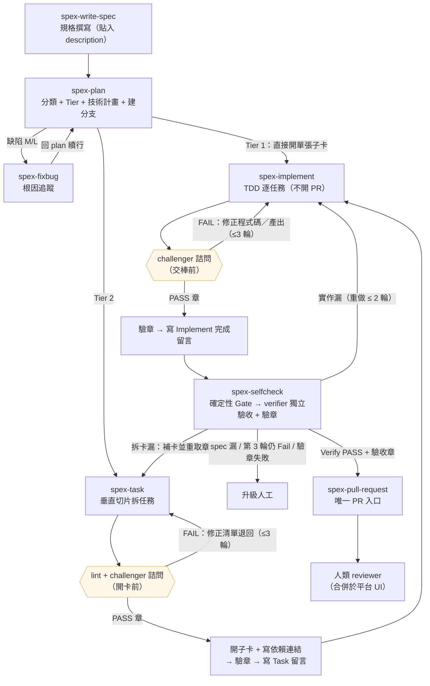
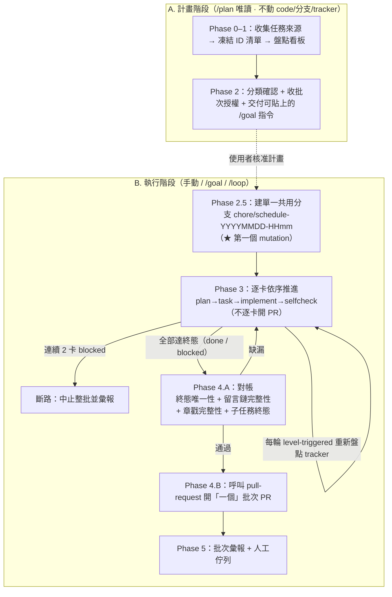
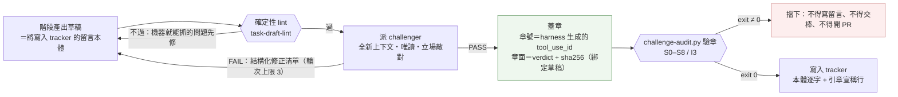

```text
   _____
  / ___/____  ___  _  __
  \__ \/ __ \/ _ \| |/_/
 ___/ / /_/ /  __/>  <
/____/ .___/\___/_/|_|
    /_/
```

> **spex** — 把一套 SDD（spec-driven development）工作流一鍵裝進任何專案。一份來源，同時落地 **Claude Code**、**GitHub Copilot**、**OpenAI Codex CLI**。

   

---

## 目錄

- [這是什麼](#這是什麼)
- [快速開始](#快速開始)
- [選哪一種安裝](#選哪一種安裝)
- [CLI 指令](#cli-指令)
- [SDD 流程](#sdd-流程)
- [批次排程](#批次排程)
- [章戳鏈：交棒憑證怎麼防偽](#章戳鏈交棒憑證怎麼防偽)
- [12 個 Skill](#12-個-skill)
- [設計原理](#設計原理)
- [沙盒版（選用）](#沙盒版選用)
- [支援的 Agent 與 Tracker](#支援的-agent-與-tracker)
- [Rules（專案規則）](#rules專案規則)
- [與其他 SDD 框架的比較](#與其他-sdd-框架的比較)
- [升級注意](#升級注意)
- [參考資料](#參考資料)

---

## 這是什麼

`spex` 是一支 CLI，把 12 個 skills、reference、專案規則與 MCP 設定裝進你的專案。四個核心設計：

| 設計 | 說明 |
|---|---|
| 一份來源、多 agent 落地 | skills/reference/rules 只維護一份，安裝時轉成各 agent 的原生格式（`.claude/`、`.github/`+`.spex/`、`.codex/`） |
| tracker 為唯一事實來源 | 狀態、證據、續行都落在 tracker 留言鏈，不依賴本機檔案。壓縮／換手／斷線後由下一輪重新盤點還原 |
| tracker 可替換 | 一律經 `TRACKER.*` 抽象介面存取。內建 Azure DevOps 與 local-file，用 `/create-adapter` 可加 Jira / Linear / GitHub Issues |
| 硬防護而非模型自律 | 獨立驗收的確定性 Gate、章戳鏈、PR 合併的 exit-2 hook、繞過管道封鎖 |

---

## 快速開始

需求：Node.js ≥ 18、Git，以及 Claude Code / GitHub Copilot / Codex CLI 至少一種。

```bash
# 1. 安裝 CLI
git clone https://github.com/bibirock/spex.git spex-cli
cd spex-cli && npm install && npm install -g .

# 2. 裝進你的專案
cd <你的專案>
spex init
```

更新：`cd <clone 路徑> && git pull && npm install -g .`

> 裝完**務必**把 `rules/commands.md` 與 `rules/testing.md` 改成你專案的實際指令與測試工具，那兩份是安裝時留的 TODO 樣板。

---

## 選哪一種安裝

**一般情況選 agent（預設）就好。**

| | **agent**（預設） | **sandbox**（選用） |
| --- | --- | --- |
| 安裝 | `spex init` | `spex init --mode sandbox` → `/spex-sandbox-init` |
| 寫碼與驗證在哪 | 本機同一份原始碼樹 | 零憑證、egress 白名單的 Docker 容器 |
| 章源 | 本 session 事件流 `~/.claude/projects/` | host 影子流（容器物理寫不到） |
| 驗章硬閘 | PreToolUse hook（`--plane agent`） | relay 執行檔；hook 轉 `--plane sandbox` 擋源頭 |
| tracker 寫入 | skill 直接呼叫 MCP | `[TRACKER-ACTION]` → host relay 代寫 |
| token 開銷 | 基準 | **2 倍以上** |
| 什麼時候用 | 一般情況 | 執行程式碼須嚴格隔離（不可外連、不可持有憑證） |

**為什麼沙盒版貴 2 倍**：host 端與沙盒端各自是一個 AI。host 要把整個階段打包成自足的派工 prompt（沙盒看不到對話歷史）、中繼 `[TRACKER-ACTION]`、還要自己重跑一次驗證束對帳；沙盒端則從冷啟動重建整份上下文。同一份需求被理解兩次——這是架構的必要成本，不是可最佳化的浪費。

換到的是：容器沒有 PAT / MCP、連不出去，而章戳鏈的載體被 tee 到掛載區之外，容器寫不到自己的成績單。**沒有隔離需求就別裝**，agent 版的獨立驗收、對抗式詰問、章戳鏈照樣完整運作。

---

## CLI 指令

### `spex init`

互動式初始化：偵測 agent、選安裝版本、挑 skills、寫入 skills/reference/rules 與各層防護。

```bash
spex init                     # 互動式，預設 agent 版
spex init --mode sandbox      # 沙盒版（--sandbox 為等價語法糖）
spex init -y                  # 非互動，一律 agent 版
```

| 選項 | 說明 |
| --- | --- |
| `--mode <agent\|sandbox>` | 安裝版本 |
| `--agent <id>` | `claude-code` / `github-copilot` / `codex`；不給則偵測 |
| `--cwd <path>` | 目標專案根目錄，預設當前目錄 |
| `--force` | 覆寫已存在檔案 |
| `-y, --yes` | 跳過互動 |

切換版本直接重跑 `spex init --mode <另一個>`，hook 條目會就地替換，不會留下兩支矛盾的 hook。

### `spex uninstall`

```bash
spex uninstall                    # 移除全部
spex uninstall spex-plan          # 只移除指定 skill
spex uninstall --agent codex -y   # 指定 agent 並跳過確認
```

防護規則與 hook 採「所有權清單」移除：只刪 spex 寫入且與常數完全相符者，使用者自訂設定一律保留。

### `spex mcp [setup]`

設定 MCP server。**機密一律走 shell 環境變數，絕不在專案內建立 dotenv 檔。**

```bash
spex mcp setup --agent claude-code
echo 'export AZURE_DEVOPS_PAT=<your-token>' >> ~/.zshrc && source ~/.zshrc
```

| Agent | 設定檔 | token 佔位 |
| --- | --- | --- |
| Claude Code | `.mcp.json` | `${VAR}` |
| GitHub Copilot | `.vscode/mcp.json` | `${env:VAR}` |
| OpenAI Codex | `.codex/config.toml` | 不內插；stdio 用 `env_vars`、http 用 `bearer_token_env_var` |

---

## SDD 流程

一張卡片從規格到 PR：`write-spec → plan →[fixbug M/L]→[task Tier2]→ implement → selfcheck ⇄(重做≤2) → pull-request`



| 重點 | 說明 |
|---|---|
| Tier 1 捷徑 | `plan` 直接開單張 Task 子卡，跳過 `task` 直進 `implement` |
| 缺陷分流 | `plan` 判缺陷 M/L → `fixbug` 根因 → 回 `plan` 續行 |
| 兩道詰問閘門 | `task` 在開卡前、`implement` 在交棒前，各要取得 challenger 的 PASS 章。輪次上限 3，由程式硬執行 |
| 重做路由依缺口層級 | `實作漏` 回 implement（≤2 次）、`拆卡漏` 回 task 補卡、`spec 漏` 升級人工。絕不無限自轉 |
| PR 唯一入口 | 只有 `pull-request` 能開 PR，前置必為 Verify PASS，且開 PR 前再驗一次章 |

---

## 批次排程

`spex-schedule` 把多卡片批次連續推過 SDD 鏈。起跑序固定：**`/plan`（唯讀，必經）→ 執行驅動三選一**。



| 重點 | 說明 |
|---|---|
| 計畫↔執行分界 | 第一個寫入動作一律在離開 `/plan` 之後，Phase 2.5 建共用分支是分界點 |
| 單一分支、一個 PR | 整批都在 `chore/schedule-<date-time>` 上實作，不逐卡建分支、不逐卡開 PR |
| level-triggered | 每輪重新盤點 tracker 推導階段，不信任上一輪快取。連續 2 卡 blocked → 斷路 |
| 驅動三選一 | 手動（小批次）/ `/goal`（大批次、無人值守）/ `/loop`（常等外部事件） |

典型呼叫：`/spex-schedule 幫我執行 <卡號1> <卡號2> … 使用 plan 來規劃`

---

## 章戳鏈：交棒憑證怎麼防偽

`spex-task`（開卡前）與 `spex-implement`（交棒前）的產出，都要先過一道對抗式詰問並取得一枚**程式可驗的章**才准寫進 tracker。



| 重點 | 說明 |
|---|---|
| 章不是一句 PASS | 章號由 harness 生成（模型鑄造不出來）、章面落在子代理事件內（主 agent 偽造不進去）、sha256 綁定受審內容（蓋章後改一個字就失效） |
| 判定與蓋章分離 | challenger 只詰問不改檔；驗章只由程式裁定，結果不可被 LLM 改判 |
| 驗收章同樣綁內容 | `selfcheck` 的驗收章綁 verifier 報告區塊，Verify 留言須逐字內嵌——編排者改不動驗證者判的 FAIL |
| 輪次上限逐卡計算 | 上限 3（含首輪），依「每張卡每個 stage」分組。章面的 `card=` 是分組依據，批次跑多卡時各卡互不累加 |
| 章源依安裝版本 | agent 版章在 session 事件流、由 PreToolUse hook 裁定；sandbox 版章在影子流、由 relay 裁定。兩平面不互相代班 |

逐條不變式（S0–S8 各擋什麼、少了會發生什麼）見 [`docs/challenge-audit-invariants.md`](docs/challenge-audit-invariants.md)。

### 章的強度分三層，不同環境不等價

| 強度 | 環境 | 章的載體與保護 | 邊界 |
|---|---|---|---|
| 最強 | sandbox 版 | 影子流由 host tee 到掛載區之外，容器物理寫不到 | Docker 非硬安全邊界（共享 kernel） |
| 中 | agent 版（Claude Code） | 事件流由 harness 寫在 `~/.claude/projects/`；PreToolUse 硬閘擋未驗章的 tracker 寫入與對事件流的改寫 | hook 的 Bash 比對是字面解析，對 compound / wrapper 變體不完備 |
| 無 | Codex / Copilot | 無 subagent 註冊機制、無事件流 → **沒有可驗的章** | 只剩確定性 lint；文件不得宣稱這裡有章 |

---

## 12 個 Skill

多數以 `/spex-<name>` 呼叫；`commit-message`、`create-adapter` 兩個工具型 skill **不帶** `spex-` 前綴。無人值守時由 `spex-schedule` 依留言鏈自動推導下一步。

| # | Skill | 角色與做什麼 | 前置 → 後續 |
|---|---|---|---|
| 1 | `spex-write-spec` | 需求分析師。問答 + 五維邊界探索 → 結構化規格；列舉完整性 grep 勾稽；規模過大拆 Story；**強制估點** | 無 → plan |
| 2 | `spex-plan` | 資深工程師。分類（需求/缺陷、Tier、缺陷規模）+ 輸入檢核 → 建分支 → 技術計畫。Tier 1 直接開單張子卡 | write-spec → task / implement / fixbug |
| 3 | `spex-fixbug` | 資深工程師。症狀五維拆解 + 強制本地重現 → 影響面 → GitHub/StackOverflow 外部調查 → 根因假設 → 修復方向（**不寫程式碼**） | plan（缺陷 M/L）→ 回 plan |
| 4 | `spex-task` | 技術領導。垂直切片拆 TDD 任務（**禁止水平分層**）→ lint + challenger 詰問 → 取 PASS 章才開卡 → 寫依賴連結 | plan（Tier 2）→ implement |
| 5 | `spex-implement` | 開發工程師。DAG 拓撲排序後逐任務 TDD（Red→Green→Refactor）→ code-reviewer 審查 → 父卡閉環 + 詰問取章。**不開 PR** | task / plan(Tier 1) → selfcheck |
| 6 | `spex-selfcheck` | 獨立驗收編排者。確定性 Gate（驗證束 + E2E）→ 全新上下文 verifier 逐條 AC 二元判定 + 防錯檢核 A–G → 驗章 → 依缺口層級路由 | implement → pull-request / implement |
| 7 | `spex-pull-request` | PR 守門員。唯一能呼叫 `createPullRequest` 的 skill。Verify Gate 不可繞道 → 組裝 → 開立 → 寫稽核留言。**不合併** | selfcheck PASS → 人類 reviewer |
| 8 | `spex-schedule` | 批次排程者。逐卡依序推過 SDD 鏈，保證終態唯一、不遺漏（見[批次排程](#批次排程)） | 各卡規格就緒 → 人類 reviewer |
| 9 | `create-adapter` | 架構設計師。12 小節問答產生新 Tracker Adapter 文件 + relay 樁檔 + 安全設定編輯。完成後改 `sdd-workflow.md` 一行即可切換 | 工具型 |
| 10 | `commit-message` | 依 Conventional Commits 產生繁中 commit 訊息。子卡 ID 一律 tracker 讀回、禁推斷 | 工具型 |
| 11 | `spex-sandbox-init` ｜僅沙盒版 | 架構設計師。依 Sandbox Profile 協定生成雙平面 Docker 沙盒。**產出可運作的沙盒，不只是文件**（委派 `render-profile.mjs` 渲染，避免 LLM 手抄走樣） | 工具型 |
| 12 | `spex-relay-init` ｜僅沙盒版 | 架構設計師。生成 relay 執行檔——沙盒零憑證寫不到 tracker，只能吐 `[TRACKER-ACTION]` 由 host 逐字代寫。relay 同時是沙盒平面的驗章硬閘 | 工具型 |

各 skill 的 Phase 拆解見 `assets/skills/<name>/SKILL.md`，跨 skill 治理規則見 [`assets/rules/sdd-workflow.md`](assets/rules/sdd-workflow.md)。

---

## 設計原理

| 原理 | 為什麼要它 | 怎麼落地 |
|---|---|---|
| **規格驅動** | 沒有規格約束時 AI 生成會飄移 | `spec-template.md` 是單一格式來源：write-spec 依它產出、plan 依它檢核、selfcheck 以「驗收標準」與「列舉完整性清單」作判定依據 |
| **獨立驗收** | LLM 無外部訊號的自我修正不可靠，做事的 agent 不能自己打分 | 確定性 Gate 先行（exit≠0 直接 Fail，零 LLM 成本）→ 全新上下文驗證者只拿 AC + diff + 機器證據做二元判定，**無證據 = Fail** → 重做上限 2 次 |
| **對抗式詰問 + 章戳鏈** | 交棒憑證若靠自述，等於沒有 | 見[章戳鏈](#章戳鏈交棒憑證怎麼防偽) |
| **PR 合併硬擋** | 開 PR 可逆可審查，真正不可逆的是合併 | v0.9.0 政策反轉：開 PR 回歸一般流程；合併改為無逃生口硬擋（見下表） |
| **MCP-only 繞過防護** | prompt 不是 access control，叫 AI「請走 MCP」沒有強制力 | 把 `curl`/`wget`/`az boards`/`gh api` 封在權限層（單一來源 `SPEX_BYPASS_COMMANDS`） |
| **教訓閉環** | 最大缺口不是「會犯錯」，而是同一類錯誤反覆犯 | Capture → Distill → Recall → Promote → Prune（見下表） |
| **tracker 為唯一事實來源** | 一般 Plan 模式只在當下對話排步驟 | 中斷續行、終態唯一性對帳、留言鏈完整性檢查、ID 事實鐵則、多 repo 絕對路徑紀律、LSP 優先導航 |

### PR 合併防護

**合併一律由人類在平台 UI 執行，AI 不得觸發。**

| 通道 | 例子 | 由誰擋 |
| --- | --- | --- |
| 平台 CLI 合併指令 | `gh pr merge`、`gh pr review --approve`、`az repos pr set-vote` | `permissions.deny`（無非合併用途，字面層直接封） |
| MCP 參數層合併 | `update_pull_request` 帶 `status: completed`、任何 `autoComplete` | **`spex-merge-guard.sh` hook**——同一工具也用來改 title，`permissions` 是工具層粒度分不出來 |
| 繞過 PR 直推 | `git push origin dev`、`git push --all`、當前分支即保護分支的裸 `git push` | 同上 hook。**`git push` 不能進 deny**——推 feature 分支是開 PR 的必經步驟 |

hook 是 `PreToolUse` exit 2，由 harness 執行、模型停不掉，互動 session 也不放行。保護分支預設 `main`/`master`/`dev`/`develop`/`development`，可用 `SPEX_PROTECTED_BRANCHES` 覆寫。

> **誠實標註**：Copilot 只有 `terminal.denyList`、Codex 只有 `sandbox_mode`，**兩者都沒有參數層防護**。Bash 比對是字面解析，對 compound command / wrapper / alias 變體不完備——這層擋的是「自動觸發」，不是有心人的刻意繞過。

### 教訓閉環

| 環節 | 觸發點 | 做什麼 |
| --- | --- | --- |
| **Capture** | selfcheck Fail / implement F.4 Fail / schedule 被使用者糾正 | 寫留言的同時萃取結構化教訓（症狀／根因／防護／升級狀態） |
| **Distill** | 寫入前 | grep `INDEX.md` 比對症狀＋根因；命中 → `recurrence+1`，**不新增** |
| **Recall** | plan / task / implement / selfcheck / schedule 前導段 | 取命中本 skill 的 `active` 教訓，把「防護」納入本輪注意事項 |
| **Promote** | `recurrence ≥ 2` | 由主編排者（非驗證者）提案升級為確定性硬防護，**人工確認後**寫入 |
| **Prune** | Recall 時 | 教訓引用的檔／旗標已不存在 → 標 `retired` |

位置 `.claude/lessons/`（Copilot `.spex/`、Codex `.codex/`），**必須 commit、禁止 gitignore**。鐵則：獨立驗證者不背 Capture/Promote。

### 估點

`write-spec` 定稿後強制估點：MVP 複雜度單軸 Fibonacci `1/2/3/5/8/13/20`，四維度綜合落點（實作面 / 狀態與契約 / 整合面 / 驗證工作量），單卡上限 13，≥20 必須拆卡。估點不影響 selfcheck 判定。成本量測用 `/cost` 或 `claude -p --output-format json` 的 `total_cost_usd`。

---

## 沙盒版（選用）

> 只在裝了 `spex init --mode sandbox` 時適用。**沒有嚴格隔離需求就跳過。**

沙盒版把探索、寫 code、跑驗證、對抗式詰問全搬進零憑證、egress 白名單的 Docker 容器；tracker 讀寫、git commit、開 PR 只留在 host。8 個核心 skill 本身不依賴 Docker。

**影子流：章為什麼偽造不了。** 容器 stdout 由 host 端的 `dispatch-watchdog-host.sh` 同時 tee 成兩份：

- **影子流** `~/.sandbox-shadow/<repo>/*.result.md`——在 repo 與掛載區之外，容器連路徑都碰不到。這是 `challenge-audit.py` 唯一信任的來源。
- **鏡像檔** `sandbox/tasks/*.result.md`——在掛載區、沙盒改得動，**只供人觀察**。拿它充當影子流＝驗了執行者可竄改的東西。

**三條通道**：① host 派工 prompt（自足，卡片原文以程式注入、禁手改）→ ② 沙盒吐 `[TRACKER-ACTION]` 由 relay 逐字代寫 → ③ 影子流。host 收到結果後**自己重跑一次驗證束**與沙盒自報數字對帳，這是決定性的反做假機制。

**三支 PreToolUse hook 並存**（沙盒版）：`sandbox-guard.sh` 守雙平面邊界、`spex-stamp-guard.sh --plane sandbox` 守章戳鏈、`spex-merge-guard.sh` 守合併。任一 exit 2 即擋；合併設定只增不換。

> **平面必須一致**：hook 若停在 `--plane agent`，會拿 host transcript 去驗沙盒內產生的章——那條流裡根本沒有 challenger 派發事件，**必然假 FAIL**。

協定見 `assets/reference/sandboxes/README.md`，relay 接線契約見 `assets/reference/spex/relay-protocol.md`。

---

## 支援的 Agent 與 Tracker

| Agent | Skill 位置 | Reference / Rules / 教訓 | MCP 設定 | 防護 |
| --- | --- | --- | --- | --- |
| Claude Code | `.claude/skills/<name>/SKILL.md` | `.claude/{reference,rules,lessons}/` | `.mcp.json` | `permissions.deny` + 2 支 PreToolUse hook |
| GitHub Copilot | `.github/prompts/<name>.prompt.md` | `.spex/{reference,rules,lessons}/` | `.vscode/mcp.json` | `terminal.denyList` |
| OpenAI Codex | `.codex/skills/<name>/SKILL.md` | `.codex/{reference,rules,lessons}/` | `.codex/config.toml` | `sandbox_mode` + `approval_policy` |

暫存目錄一律 `spex-temp/`（用時才建、用後即刪）。環境變數一律來自 shell，不落檔。

| Tracker Adapter | 狀態 | 說明 |
| --- | --- | --- |
| `azure-devops`（`ado`） | 預設、最完整 | 透過 Azure DevOps MCP 讀寫 work item；隨附範例值皆為佔位符 |
| `local-file` | 內建 | 無 tracker 時的純檔案模式，狀態落在 `specs/<日期>/<任務名>/`（階段留言 append-only） |
| Jira / Linear / GitHub Issues … | 待新增 | 跑 `/create-adapter` 產生，完成後改 `sdd-workflow.md` 的 `Tracker Adapter:` 一行即可切換 |

協定見 `assets/reference/adapters/README.md`。

---

## Rules（專案規則）

`assets/rules/*.md` 是安裝到目標專案的**專案設定**，取代過去要手寫進 `CLAUDE.md` 的章節，安裝後由專案直接手動維護。

| 規則檔 | 內容 |
| --- | --- |
| `sdd-workflow.md` | Tracker Adapter、Branch 命名與生命週期、Definition of Done、PR 開立/合併控管、MCP-only 封鎖、Fail 判定、章戳鏈、教訓回收與升級、批次進度持久化、ID 事實鐵則、多 repo 紀律、導航策略 |
| `commands.md` | 驗證指令束（lint-fix / lint / typecheck / test）與各 npm script |
| `testing.md` | 測試層次與框架、E2E 工具與指令、UI 驗證步驟、artifact 目錄 |

規則以 frontmatter 的 `skills:` scope 到對應 skill：Claude Code 翻成 `paths:`、Copilot 翻成 `applyTo:`、Codex 以 HTML 註解標示。

---

## 與其他 SDD 框架的比較

代表性工具是 [GitHub Spec Kit](https://github.com/github/spec-kit)（Spec → Plan → Tasks → Implement，支援 30+ agent）與 [BMAD-METHOD](https://github.com/bmad-code-org/BMAD-METHOD)（多專職 agent 模擬敏捷團隊）。spex 起步較晚，補的是「流程跑完之後，怎麼確保真的做對」這一段。

| 面向 | Spec Kit / BMAD（依公開資訊） | spex |
| --- | --- | --- |
| 核心流程終點 | 到 Implement 即結束；獨立審查多為擴充或規劃中 | **獨立驗收是核心強制步驟**，全新上下文逐條 AC 二元判定，無證據一律 Fail |
| PR 合併 | 由 agent 依 prompt 自行判斷，屬約定 | **技術層硬閘**：deny 封合併 CLI + exit-2 hook 擋參數層合併與直推保護分支 |
| 執行環境隔離 | 未見標準化沙盒 / 憑證隔離 | **選用安裝版本**：零憑證、egress 白名單的 Docker 沙盒 + 章戳鏈 |
| 任務狀態來源 | 規格多落在 repo 內檔案 | **tracker 留言鏈為唯一事實來源**，可跨壓縮 / 斷線 / 多 agent 交接還原 |
| Agent 支援廣度 | Spec Kit 30+，生態較成熟 | 目前 3 種，透過 adapter 架構可擴充 |

> 依公開文件與 repo 現況整理，這類工具更新頻繁，請以官方最新狀態為準。

---

## 升級注意

- **v0.9.0 — PR 政策反轉，防護從「開立」搬到「合併」**
  1. 開 PR 回歸一般流程，不再有開立前的人為確認與授權語句機制。重跑 `spex init` 會自動移除舊版寫在 `permissions.ask` 的三條開 PR 規則。
  2. 合併改為無逃生口硬擋：新增合併 CLI 的 `permissions.deny` 與第二支 hook `spex-merge-guard.sh`。**互動 session 也不能合併**，請到平台 UI 操作。
  3. `sdd-workflow.md` 新增 `## PR 合併控管` 章節。
- **v0.8.0 — 分成 agent / sandbox 兩種安裝版本**
  1. 既有專案重跑 `spex init` 會落到 agent 版；`init` 只寫不刪，先前的沙盒資產**不會**自動移除，要清乾淨請先 `spex uninstall`。
  2. 正在用沙盒的專案請改跑 `spex init --mode sandbox`（hook 的 `--plane` 參數若不一致必然假 FAIL）。
  3. 三支 hook 並存，合併 `settings.sandbox-snippet.json` 時只增不換。
- **v0.7.0**：新增 `spex-sandbox-init`；`create-adapter` 擴充 relay 樁檔生成與安全設定編輯；adapter 協定新增「分支前綴宣告」與「規格建卡欄位對照」，`sdd-workflow.md` 的 Branch Naming 改讀 adapter 宣告、不再寫死 `ADO-`。
- **v0.6.0**：三軌治理隨 `init` 落地——MCP-only 繞過防護、教訓閉環（`.claude/lessons/`，**必 commit**）、DoD「測試未弱化」。
- **v0.5.0（歷史）**：移除 `spex-clarity`、`spex-orchestrate`、`create-sdd-workflow`。從 < v0.5.0 升級請先 `uninstall` 再重裝。

**常見問題**
- 無法讀取 ADO 任務 → 確認 shell 有 `export AZURE_DEVOPS_PAT=<token>` 並已 source，且 token 權限足夠。
- 無法讀到 ADO 圖片 → 見 `assets/reference/adapters/azure-devops/ado-attachment-images.md`。

---

## 參考資料

**教訓閉環**：Reflexion: Language Agents with Verbal Reinforcement Learning（反思式記憶）· Lessons-learned ledger / 結構化世代記憶

**確定性護欄 / MCP-only 防護**：[O'Reilly — AI Agents Need Guardrails](https://www.oreilly.com/radar/ai-agents-need-guardrails/) · [Civic — Deterministic guardrails](https://www.civic.com/developer-portal-resources/deterministic-guardrails-for-ai-agent-security) · [Strata — Prevent MCP Bypass](https://www.strata.io/blog/agentic-identity/prevent-mcp-bypass/)

**各 agent 原生強制機制**：[Claude Code — Permissions](https://code.claude.com/docs/en/permissions) · [VS Code Copilot — allow/deny lists](https://4sysops.com/archives/new-in-vs-code-github-copilot-command-allowdeny-lists-resubmit-requests-mcp-server-catalog/) · [OpenAI Codex — Config](https://developers.openai.com/codex/config-basic) · [Sandbox](https://developers.openai.com/codex/concepts/sandboxing)

**未來強化**：Policy-as-Code（OPA）——把規則寫成版本控管、可測試的 policy，由獨立 enforcement point 攔截。

---

## 授權

[MIT License](LICENSE)。`package.json` 的 `private: true` 僅為避免誤 `npm publish`，與授權範圍無關。歡迎 fork、回報 issue 或送 PR；開發本 repo 的架構說明見 [`CLAUDE.md`](CLAUDE.md) 與 [`AGENTS.md`](AGENTS.md)。
