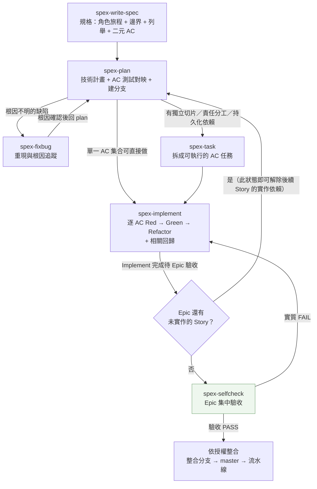
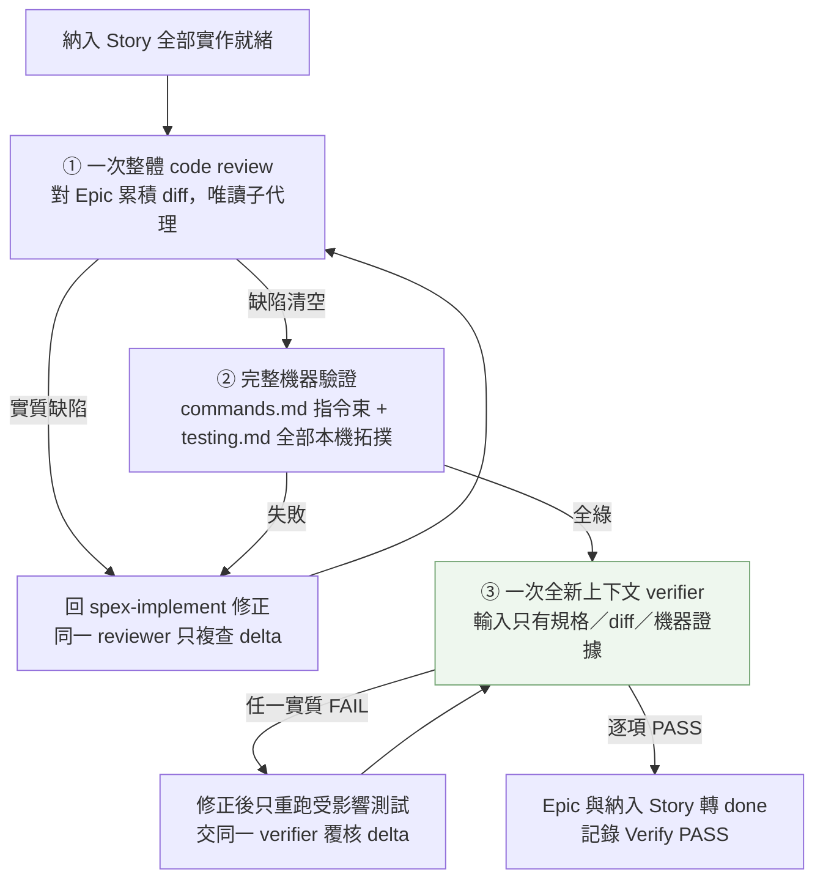
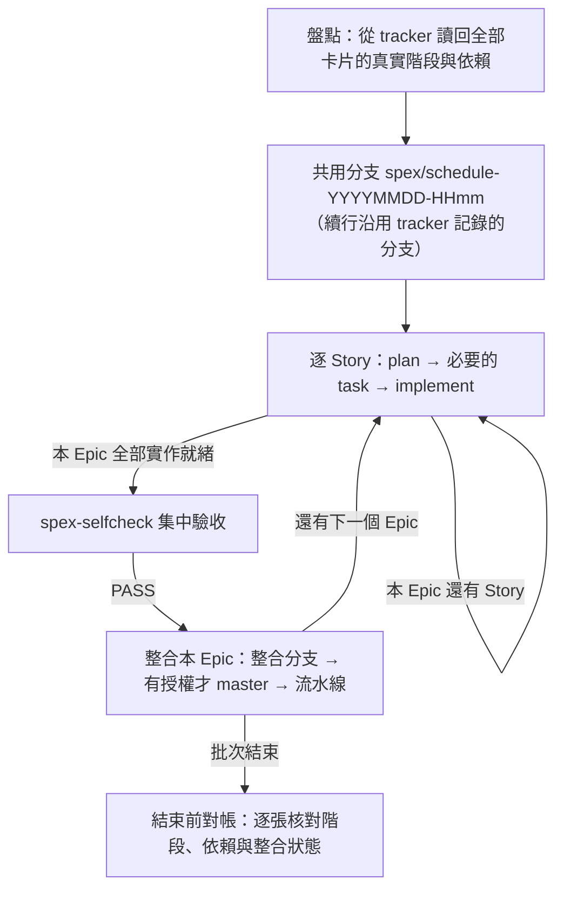

```text
   _____
  / ___/____  ___  _  __
  \__ \/ __ \/ _ \| |/_/
 ___/ / /_/ /  __/>  <
/____/ .___/\___/_/|_|
    /_/
```

> **spex** — 把一套 SDD（spec-driven development）工作流一鍵裝進任何專案。一份來源，同時落地 **Claude Code**、**GitHub Copilot**、**OpenAI Codex CLI**。

   

---

## 目錄

- [這是什麼](#這是什麼)
- [快速開始](#快速開始)
- [CLI 指令](#cli-指令)
- [SDD 流程](#sdd-流程)
- [Epic 集中驗收](#epic-集中驗收)
- [批次排程](#批次排程)
- [9 個 Skill](#9-個-skill)
- [設計原理](#設計原理)
- [支援的 Agent 與 Tracker](#支援的-agent-與-tracker)
- [Rules（專案規則）](#rules專案規則)
- [與其他 SDD 框架的比較](#與其他-sdd-框架的比較)
- [參考資料](#參考資料)

---

## 這是什麼

`spex` 是一支 CLI，把 9 個 skills、兩個唯讀子代理、reference、專案規則、編輯期 hook 與 MCP 設定裝進你的專案。四個核心設計：

| 設計 | 說明 |
|---|---|
| 一份來源、多 agent 落地 | skills / agents / reference / rules / hooks 只維護一份，安裝時轉成各 agent 的原生格式（`.claude/`、`.github/`+`.spex/`、`.codex/`） |
| tracker 為唯一事實來源 | 狀態、證據、續行都落在 tracker 留言鏈，不依賴本機檔案。壓縮／換手／斷線後由下一輪重新盤點還原 |
| tracker 可替換 | 一律經 `TRACKER.*` 抽象介面存取。內建 Azure DevOps 與 local-file，用 `/create-adapter` 可加 Jira / Linear / GitHub Issues |
| Epic 集中驗收 | 逐 Story 跑 focused TDD，整個 Epic 就緒後才做一次整體 review、一次完整機器驗證、一次全新上下文獨立驗收 |

---

## 快速開始

需求：Node.js ≥ 18、Git，以及 Claude Code / GitHub Copilot / Codex CLI 至少一種。

```bash
# 1. 安裝 CLI
git clone https://github.com/bibirock/spex.git spex-cli
cd spex-cli && npm install && npm install -g .

# 2. 裝進你的專案
cd <你的專案>
spex init
```

更新：`cd <clone 路徑> && git pull && npm install -g .`

裝完有兩件事要做：

1. 把 `rules/commands.md` 與 `rules/testing.md` 改成你專案的實際指令與測試工具——那兩份是安裝時留的 TODO 樣板，skill 引用驗證指令與 E2E 工具時以它們為唯一來源。
2. 在 `hooks/spex-hooks.env` 填入本專案的 lint / format 指令；留空即停用該支 hook。

---

## CLI 指令

### `spex init`

互動式初始化：偵測 agent、挑 skills、寫入 skills / agents / reference / rules / hooks。

```bash
spex init                     # 互動式
spex init -y                  # 非互動，全選
```

| 選項 | 說明 |
| --- | --- |
| `--agent <id>` | `claude-code` / `github-copilot` / `codex`；不給則偵測 |
| `--cwd <path>` | 目標專案根目錄，預設當前目錄 |
| `--force` | 覆寫已存在檔案（`spex-hooks.env` 例外，永遠不覆寫你填的指令） |
| `-y, --yes` | 跳過互動 |

### `spex uninstall`

```bash
spex uninstall                    # 移除全部
spex uninstall spex-plan          # 只移除指定 skill
spex uninstall --agent codex -y   # 指定 agent 並跳過確認
```

hook 條目採「所有權清單」移除：只刪 spex 寫入且與常數完全相符者，使用者自訂設定一律保留。

### `spex mcp [setup]`

設定 MCP server。**機密一律走 shell 環境變數，絕不在專案內建立 dotenv 檔。**

```bash
spex mcp setup --agent claude-code
echo 'export AZURE_DEVOPS_PAT=<your-token>' >> ~/.zshrc && source ~/.zshrc
```

| Agent | 設定檔 | token 佔位 |
| --- | --- | --- |
| Claude Code | `.mcp.json` | `${VAR}` |
| GitHub Copilot | `.vscode/mcp.json` | `${env:VAR}` |
| OpenAI Codex | `.codex/config.toml` | 不內插；stdio 用 `env_vars`、http 用 `bearer_token_env_var` |

---

## SDD 流程

一張 Story 從規格到實作就緒：`write-spec → plan →[fixbug]→[task]→ implement`。
Epic 內每張 Story 各跑各的 focused TDD，全部就緒後才進 `selfcheck` 一次集中驗收。



| 重點 | 說明 |
|---|---|
| 不強制拆卡 | Plan 清楚就直接 implement；只有獨立切片、責任分工或持久化依賴才進 `task` |
| 缺陷分流看根因 | 根因已知直接規劃修復；未知才走 `fixbug`，不因缺陷規模強制多一站 |
| Story 不各自驗收 | Story 完成 focused TDD 即記「Implement 完成待 Epic 驗收」，維持 `in_progress` |
| 依賴用實作就緒解除 | 待驗收的 Story 可滿足後續 Story 的實作依賴；需要實際部署的依賴仍看事實 |
| master 需明確授權 | 驗收 PASS 不產生 master 授權；授權可涵蓋指定 Epic／批次，之後不逐次重問 |

---

## Epic 集中驗收

`spex-selfcheck` 是驗收單位的唯一收口。沒有 Epic 的單卡以自身為驗收單位，走同一條路。



| 重點 | 說明 |
|---|---|
| 三道各做一次 | review、完整驗證、獨立驗收各一次，不逐 Task／逐 Story 重做 |
| 驗證者拿不到推理 | verifier 只收規格、必要 Task、實際 diff 與原始機器證據，不收實作推理或上游通過結論 |
| 無證據 = FAIL | 對映表、實作碼存在、schema 或文字搜尋都不能替代行為測試 |
| 只重驗受影響範圍 | 修正後不重掃未變內容；未受影響且仍適用的證據繼續沿用 |
| 不設輪次上限 | 只要有可驗證的根因或下一步就繼續；缺必要外部輸入才暫停該項並回報 |

---

## 批次排程

`spex-schedule` 把多張卡片在**一個共用分支**上逐 Story 推過 SDD 鏈，按 Epic 分組驗收。
每個 Epic 通過就處理該 Epic 的整合，不等整批結束。



| 重點 | 說明 |
|---|---|
| 單一共用分支 | 不逐卡建分支；續行從 tracker 讀回原分支，不用今天的日期重推名稱 |
| 每輪重新盤點 | 階段由 tracker 留言鏈推導，不信任上一輪快取，壓縮／換手後可直接接續 |
| Epic 完成即交付 | 驗收通過就整合該 Epic，不把後續未完成 Epic 一併帶入 |
| 失敗只隔離該項 | 可解決的持續修正；缺必要外部輸入才記錄缺口，其他不依賴它的工作繼續 |

典型呼叫：`/spex-schedule 幫我執行 <卡號1> <卡號2> …`

---

## 9 個 Skill

多數以 `/spex-<name>` 呼叫；`commit-message`、`create-adapter` 兩個工具型 skill **不帶** `spex-` 前綴。

| # | Skill | 角色與做什麼 | 前置 → 後續 |
|---|---|---|---|
| 1 | `spex-write-spec` | 需求分析師。角色旅程 + 六維邊界探索 → 結構化規格；列舉完整性以 `rg` 勾稽全 codebase；估點 | 無 → plan |
| 2 | `spex-plan` | 技術規劃師。確認驗收單位（Epic／單卡）→ 定位影響面 → 盤點既有測試契約 → AC 測試對映 → 建分支 | write-spec → task / implement / fixbug |
| 3 | `spex-fixbug` | 資深工程師。症狀五維拆解 + 本地重現 → 可驗證假設表 → 修復方向（**不寫產品程式碼**） | plan（根因不明）→ 回 plan |
| 4 | `spex-task` | 任務分解師。只在有獨立切片、責任分工或持久化依賴時拆卡；每張帶 Red / Green / Refactor 與完成條件 | plan → implement |
| 5 | `spex-implement` | 開發工程師。逐 AC TDD + 相關回歸 → 保存「Implement 完成待 Epic 驗收」 | task / plan → 下一 Story / selfcheck |
| 6 | `spex-selfcheck` | 驗收編排者。整體 review → 完整機器驗證 → 全新上下文 verifier；三道各一次 | 全部 Story 實作就緒 → 授權整合 |
| 7 | `spex-schedule` | 批次排程者。共用分支逐 Story 推進，按 Epic 集中驗收與整合，支援中斷續行 | 各卡規格就緒 → 整合交付 |
| 8 | `create-adapter` | 架構設計師。產生新 Tracker Adapter 文件（10 個核心操作），完成後改 `sdd-workflow.md` 一行即可切換 | 工具型 |
| 9 | `commit-message` | 依 Conventional Commits 產生繁中 commit 訊息。子卡 ID 一律 tracker 讀回、禁推斷 | 工具型 |

另有兩個唯讀子代理：`code-reviewer`（Epic 整體審查）與 `verifier`（獨立驗收）。
各 skill 全文見 `assets/skills/<name>/SKILL.md`，跨 skill 治理規則見 [`assets/rules/sdd-workflow.md`](assets/rules/sdd-workflow.md)。

---

## 設計原理

| 原理 | 為什麼要它 | 怎麼落地 |
|---|---|---|
| **規格驅動** | 沒有規格約束時 AI 生成會飄移 | `spec-template.md` 是單一格式來源：write-spec 依它產出、plan 依它檢核、selfcheck 以「驗收標準」與「列舉完整性清單」作判定依據 |
| **獨立驗收** | LLM 無外部訊號的自我修正不可靠，做事的 agent 不能自己打分 | 完整機器驗證先行（exit code 說了算）→ 全新上下文驗證者只拿規格 + diff + 機器證據做二元判定，**無證據 = FAIL** |
| **Epic 集中驗收** | 逐卡跑全量測試與整體 review，成本高又製造假動作 | 開發期只跑相關測試；整個 Epic 就緒後才一次完整驗證。修正只重驗受影響範圍，未變證據沿用 |
| **範圍即契約** | AC 全過但 In Scope 條列或邊界項漏做，是最常見的假完成 | AC、In Scope、邊界條件、列舉成員全部進驗收範圍，並列條件逐項核對，不驗代表案例了事 |
| **保留既有測試契約** | 改測試讓它過，是最便宜的假綠 | 測試改寫／合併／移除須對照已核准規格記錄原保證與替代證據；弱化斷言視為缺陷 |
| **編輯期確定性檢查** | 讓機器抓得到的問題不該燒在 review 上 | 兩支 `PostToolUse` hook 對剛異動的單檔跑 lint 與格式化；lint 失敗以 exit 2 把訊息回報給代理 |
| **教訓閉環** | 最大缺口不是「會犯錯」，而是同一類錯誤反覆犯 | 只記可重用的根因與產品防護，寫入前先去重；流程移除時教訓一併退場，不留過期記憶 |
| **tracker 為唯一事實來源** | 一般 Plan 模式只在當下對話排步驟 | 中斷續行、逐張對帳、ID 事實鐵則（一律讀回、禁推斷）、多 repo 絕對路徑紀律 |

### master 授權

整合分支（`dev` / `develop` / `development`）的合併與推送在已授權範圍內自動進行；
**合併或推送 `master` / `main` 一律需要使用者明確授權**，授權可涵蓋指定 Epic／批次，驗收通過後直接執行，不逐次重問。

授權依據只有使用者訊息本身。tracker 可以保存其原文與範圍作定位，但 agent 自寫的旗標、文件或驗收 PASS 都不構成授權。

---

## 支援的 Agent 與 Tracker

| Agent | Skill 位置 | Reference / Rules / 教訓 | 子代理 | 編輯期 hook | MCP 設定 |
| --- | --- | --- | --- | --- | --- |
| Claude Code | `.claude/skills/<name>/SKILL.md` | `.claude/{reference,rules,lessons}/` | `.claude/agents/*.md` | `.claude/settings.json` + `.claude/hooks/` | `.mcp.json` |
| OpenAI Codex | `.codex/skills/<name>/SKILL.md` | `.codex/{reference,rules,lessons}/` | `.codex/agents/*.toml` | `.codex/hooks.json` + `.codex/hooks/` | `.codex/config.toml` |
| GitHub Copilot | `.github/prompts/<name>.prompt.md` | `.spex/{reference,rules,lessons}/` | 無原生機制，開新 Chat 依定義手動執行 | 無 hook 機制 | `.vscode/mcp.json` |

暫存目錄一律 `spex-temp/`（用時才建、用後即刪）。環境變數一律來自 shell，不落檔。

| Tracker Adapter | 狀態 | 說明 |
| --- | --- | --- |
| `azure-devops`（`ado`） | 預設 | 透過 Azure DevOps MCP 讀寫 work item；隨附範例值皆為佔位符 |
| `local-file` | 內建 | 無 tracker 時的純檔案模式，狀態落在 `specs/<日期>/<任務名>/`（階段留言 append-only） |
| Jira / Linear / GitHub Issues … | 待新增 | 跑 `/create-adapter` 產生，完成後改 `sdd-workflow.md` 的 `Tracker Adapter:` 一行即可切換 |

協定見 `assets/reference/adapters/README.md`：10 個必填 `TRACKER.*` 操作，adapter 不支援者須標明限制與替代方案，不可刪章節。

---

## Rules（專案規則）

`assets/rules/*.md` 是安裝到目標專案的**專案設定**，取代要手寫進 `CLAUDE.md` 的章節，安裝後由專案直接維護。

| 規則檔 | 內容 |
| --- | --- |
| `sdd-workflow.md` | Tracker Adapter、核心原則、Plan 分析順序、Branch 命名與政策、Epic 驗收與整合、DoD、Fail 判定、ID 事實鐵則、多 repo 紀律、教訓回收與升級 |
| `commands.md` | 驗證指令束、唯讀驗證指令束、migration 指令、編輯期 hook 指令 |
| `testing.md` | 測試層次與框架、E2E / UI 工具與指令、執行順序與重驗範圍、證據與 artifact 保存 |

規則以 frontmatter 的 `skills:` scope 到對應 skill：Claude Code 翻成 `paths:`、Copilot 翻成 `applyTo:`、Codex 以 HTML 註解標示（由 skill 執行時主動讀取）。

---

## 與其他 SDD 框架的比較

代表性工具是 [GitHub Spec Kit](https://github.com/github/spec-kit)（Spec → Plan → Tasks → Implement，支援 30+ agent）與 [BMAD-METHOD](https://github.com/bmad-code-org/BMAD-METHOD)（多專職 agent 模擬敏捷團隊）。spex 起步較晚，補的是「流程跑完之後，怎麼確保真的做對」這一段。

| 面向 | Spec Kit / BMAD（依公開資訊） | spex |
| --- | --- | --- |
| 核心流程終點 | 到 Implement 即結束；獨立審查多為擴充或規劃中 | **獨立驗收是核心強制步驟**，全新上下文逐條 AC 二元判定，無證據一律 FAIL |
| 驗收單位 | 以單一任務／卡片為主 | **Epic 集中驗收**：逐 Story focused TDD，整個 Epic 就緒才一次完整驗證，修正只重驗受影響範圍 |
| 驗收範圍 | 多以 AC 清單為準 | AC、In Scope、邊界條件、**列舉成員**全部進範圍，並列條件逐項核對 |
| 任務狀態來源 | 規格多落在 repo 內檔案 | **tracker 留言鏈為唯一事實來源**，可跨壓縮 / 斷線 / 多 agent 交接還原 |
| Agent 支援廣度 | Spec Kit 30+，生態較成熟 | 目前 3 種，透過 adapter 架構可擴充 |

> 依公開文件與 repo 現況整理，這類工具更新頻繁，請以官方最新狀態為準。

**常見問題**
- 無法讀取 ADO 任務 → 確認 shell 有 `export AZURE_DEVOPS_PAT=<token>` 並已 source，且 token 權限足夠。
- 無法讀到 ADO 圖片 → 見 `assets/reference/adapters/azure-devops/ado-attachment-images.md`。
- lint hook 沒作用 → `hooks/spex-hooks.env` 的 `SPEX_LINT_COMMAND` 留空即為停用，填入指令後才生效。

---

## 參考資料

**教訓閉環**：Reflexion: Language Agents with Verbal Reinforcement Learning（反思式記憶）· Lessons-learned ledger / 結構化世代記憶

**確定性護欄**：[O'Reilly — AI Agents Need Guardrails](https://www.oreilly.com/radar/ai-agents-need-guardrails/) · [Civic — Deterministic guardrails](https://www.civic.com/developer-portal-resources/deterministic-guardrails-for-ai-agent-security)

**各 agent 原生機制**：[Claude Code — Hooks](https://code.claude.com/docs/en/hooks) · [Claude Code — Subagents](https://code.claude.com/docs/en/sub-agents) · [OpenAI Codex — Config](https://developers.openai.com/codex/config-basic)

---

## 授權

[MIT License](LICENSE)。`package.json` 的 `private: true` 僅為避免誤 `npm publish`，與授權範圍無關。歡迎 fork、回報 issue 或送 PR；開發本 repo 的架構說明見 [`CLAUDE.md`](CLAUDE.md) 與 [`AGENTS.md`](AGENTS.md)。
